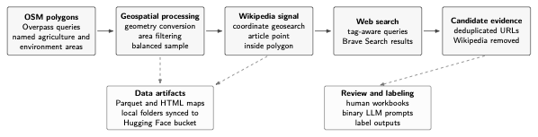

# Pipeline overview



Additional repository diagrams are available in [docs/diagrams.md](docs/diagrams.md).

This project focuses on OpenStreetMap (OSM) polygons, for which half of them do not have direct geolocated wikipedia articles (via the API) and the other half does have wikipedia articles. For such polygons we want to scrap text online and associate it to these polygons. We focus on english and french as a language. We are first going to take into account 100 polygons sparsely distributed across France and ensure that half of them do not have wikipedia articles associated with these through the API. We are aiming for polygons whose size are roughly equivalent to a town. We will have to figure out which search engine is the best fit for the task while keeping in mind that we want to select an option offering sufficient limits for it to be scalable to a larger area in further iterations. Another consideration of the project is also to figure out how to fetch text online given an OSM polygon and which level of details do we aims while queryig the web (region? department? and so on). We will restrain ourselves to a number of 10 web articles per polygon as a first iteration. The outcome of this pipeline is meant to be assessed using two kinds of evaluators: a human assessor which is going to manually review search results and a similar process but using an LLM as a judge. The inter rater agreement will thus be computed in order to understand whether the two raters are on the same wavelength. 

Future ideas: 
- Perform name entity recognition on the text we scrapped, link these entities to their coordinates (gazeteer or wikipedia page when available + LLM disambuigation). This will therefore enable us to compute an average of these coordiates and compare them to the polygon to figure whether the zone is relevant spatially (the polygon) and semantically (the text). 
- If similarity between polygons has to be computed we ca think of comparing embeddings (Alpha Earth) or satellite images.
- Revisit the current choice of removing all Wikipedia URLs from web-search results. The coordinate-based Wikipedia API already covers articles with geotagged locations, but this may miss useful Wikipedia evidence when an article has no coordinates, or when a relevant place is only mentioned inside a broader article. A future version should use a more nuanced rule instead of excluding every Wikipedia URL.
- Normalize local-language metadata for worldwide polygon sampling before scaling the search run. The current worldwide sentence pilot resolves some obvious cases through a separate `query_local_language` field, so search can use English plus a local language without overwriting the original metadata. However, some polygons coming from automatically discovered Geofabrik extracts still inherit broad region defaults such as `en`, even when the local evidence language should be Arabic, Spanish, French, Portuguese, Danish, or another language. Before running this at full scale, we should build and validate a more complete extract/country-to-language mapping for the full 5,000-polygon sample.

We separate concerns by keeping the code in this repository while keeping the data in a hugging face bucket :

```
hf://buckets/NoeFlandre/georeset-osm-web-evidence
```
