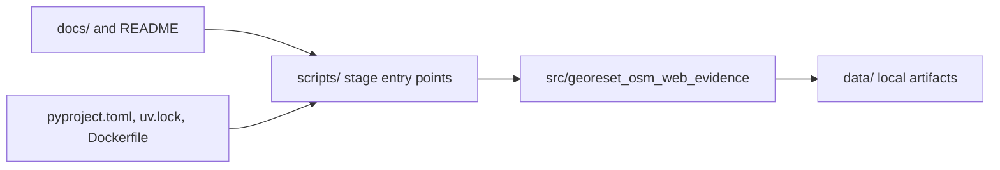
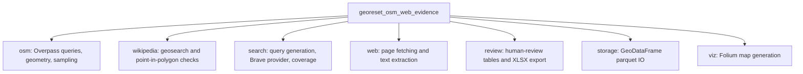
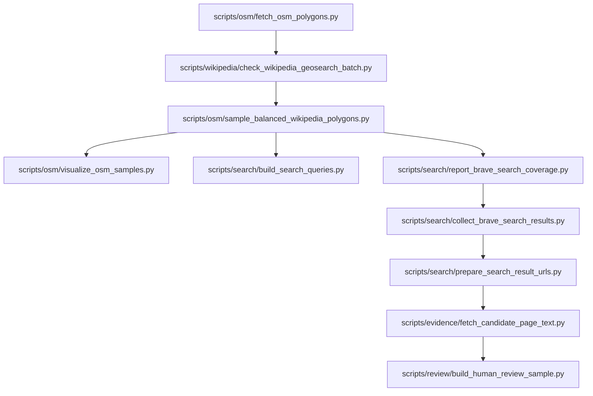
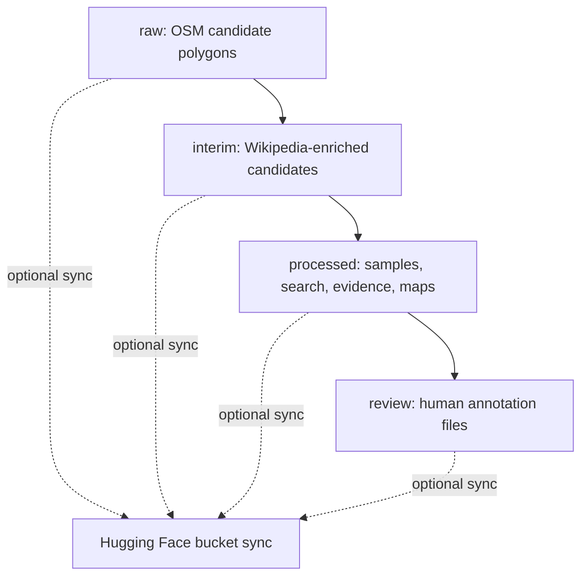
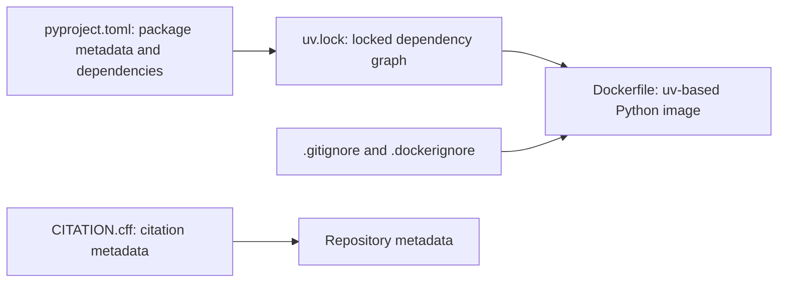

# Repository Diagrams

These diagrams describe the repository structure and implemented pipeline. They
omit open research ideas and downstream analysis steps that are not part of the
artifact pipeline.

## High-Level Architecture

The scripts are thin command-line entry points. Most reusable behavior lives in
the Python package under `src/georeset_osm_web_evidence`.

## Module Map

## Data-Flow Pipeline

```mermaid
flowchart LR
    BBox["Configured France bboxes"]
    Overpass["Overpass OSM fetch"]
    RawOSM["data/raw/osm/named_polygon_candidates.parquet"]
    Wiki["Wikipedia coordinate geosearch"]
    WikiArtifact["data/interim/wikipedia/named_polygon_candidates_wikipedia.parquet"]
    Sample["Balanced sample"]
    SampleArtifact["data/processed/samples/balanced_wikipedia_100.parquet"]
    Brave["Brave Search results"]
    Results["data/processed/search/brave_results_sample.parquet"]
    URLs["data/processed/search/brave_candidate_urls_sample.parquet"]
    Text["Fetched page text"]
    Evidence["data/processed/evidence/page_text_sample.parquet"]
    Review["Human review CSV/XLSX"]
    ReviewArtifact["data/review/human_review_sample.*"]

    BBox --> Overpass --> RawOSM
    RawOSM --> Wiki --> WikiArtifact
    WikiArtifact --> Sample --> SampleArtifact
    SampleArtifact --> Brave --> Results
    Results --> URLs
    URLs --> Text --> Evidence
    Evidence --> Review --> ReviewArtifact
```

The search URL stage removes Wikipedia URLs before page-text fetching. This is a
known limitation because coordinate-based Wikipedia geosearch can miss relevant
articles without coordinates.

## Script Workflow

`search/search_brave_sample.py` is a small Brave API smoke test and is excluded
from the main workflow because it is not part of the artifact pipeline.

## Artifact Lifecycle

The repository keeps code in Git and treats `data/` as generated local artifacts.
The project README points to the Hugging Face bucket used for external data
storage.

## Config And Runtime

The runtime is Python 3.10+ with `uv`; Brave Search requires
`BRAVE_SEARCH_API_KEY`.
